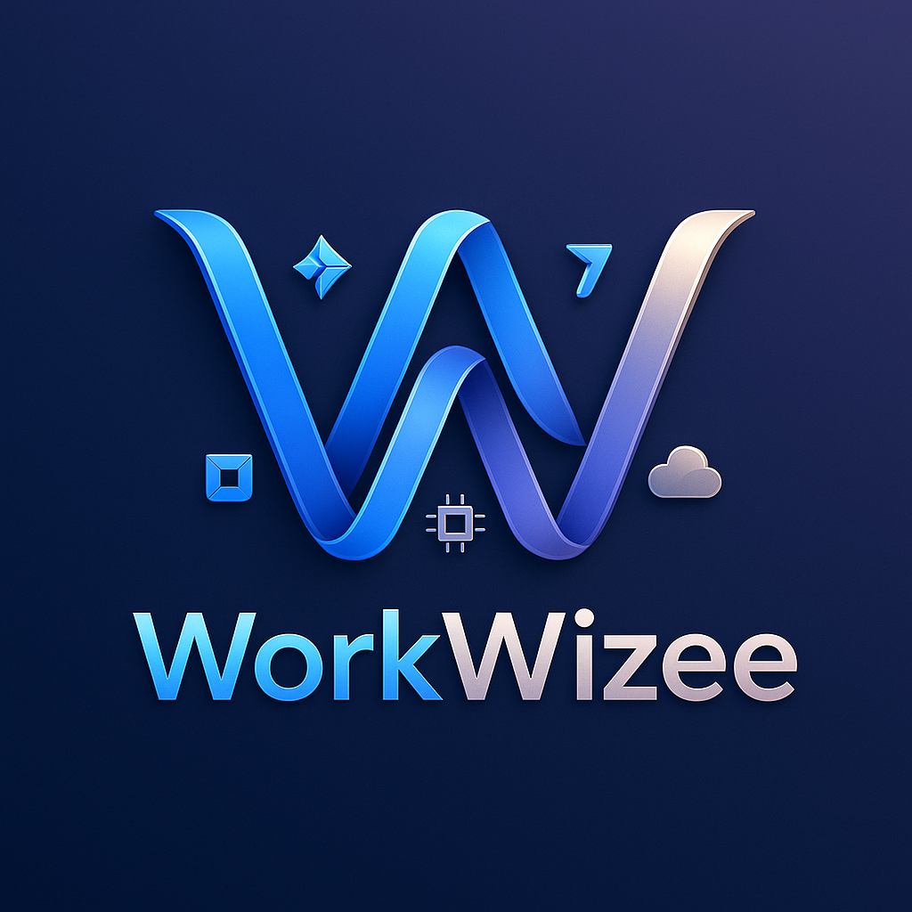
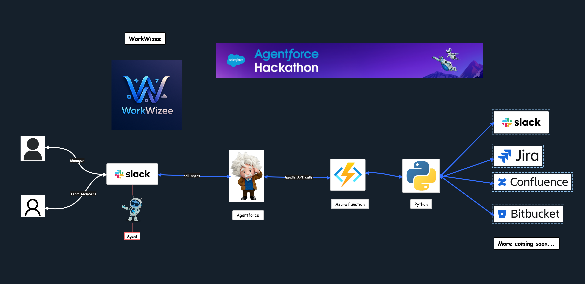

# WorkWizee



Boost team productivity with our integrated **Slack Agentforce** application, connecting Slack, Jira, BitBucket, and Outlook to automate tasks, enhance collaboration, and simplify project management. Seamlessly manage Jira tickets, BitBucket PRs, and Outlook meetings, all from within Slack

## Table of Contents

1. [Introduction](#workwizee)
2. [Architecture](#architecture)
3. [Features](#features)
   - [Slack](#slack)
   - [Jira](#jira)
   - [Bitbucket](#bitbucket)
   - [Outlook](#outlook)
4. [Azure Functions](#azure-functions)
   - [Endpoints](#endpoints)
5. [Inspiration](#inspiration)
6. [What it does](#what-it-does)
7. [How We Built It](#how-we-built-it)
8. [Serverless Endpoints](#serverless-endpoints)
9. [How To Test and Deploy](#how-to-test-and-deploy)
   - [Testing the Application](#testing-the-application)
   - [Deploying the Application](#deploying-the-application)


## Architecture



## Features

### Slack

#### ✅ Done 

- Send individual message
- Send a message to all the direct reports
- Create a channel and add members

#### 👨🏻‍💻 Working
- Send this message if not already to this person

### Jira

#### ✅ Done 

- Create Jira ticket and assign it to a user
- Comment on a jira ticket
- Get the latest comment from Jira

#### 👨🏻‍💻 Working
- Update jira ticket with story point, sprint, assigne, priority

### Bitbucket

#### ✅ Done 
- Create a PR from user branch to dev, stg, prod

#### 👨🏻‍💻 Working

- Get current open PR, user should mention the repo and from branch
- Comment on a PR to let the reviewer to approve or reject the PR

### Outlook

#### 👨🏻‍💻 Working

- Send emails from Slack to multiple users
- Send meeting invite and create a Slack channel to discuss more on the issue
- Book a room for 4 people to discuss this issue

## Azure Functions

All the endpoints are deployed in Azure Functions and the configuration is added in the External Credentials page

### Endpoints

#### Slack

- /api/slack_send_message
- /api/slack_create_channel_for_users

#### Jira

- /api/jira_add_comment
- /api/jira_create_ticket
- /api/jira_get_latest_comments

#### Bitbucket

- /api/bitbucket_create_pr
- /api/bitbucket_get_open_pr
- /api/bitbucket_comment_on_pr

#### Outlook

- /api/outlook_send_mail
- /api/outlook_book_meeting_room
- /api/outlook_search_mail

Pending integrations with below,

- Teams
- Confluence
- Jenkins
- Azure Devops

## Inspiration
Having been on multiple P1/P2 calls to solve data pipeline bugs. I understand the pain a development team has to go through, and it gets worse if you're new to the team. Let's create a process that makes this pain easier to navigate. Put agents to work and get the annoying things out of the way so you can focus on resolving the bugs ASAP. You know, once you start the P1/P2 calls, you need to update many things: ServiceNow ticket, Jira ticket, your manager, team lead, team members, and so on..
Finally, send out an RCA mail and create a Confluence page for the issue. What if we can make it all happen just by using an agent and from the comfort of Slack? That's where WorkWizee helps you and your team to **save 40% of your time**.


## What it does

It can help in these different scenarios. The following are the features you can use,

### Slack


- Send individual messages to multiple users
- Send a message to all the direct reports
- Create a channel and add members

### Jira


- Create a Jira ticket and assign it to a user with story point, priority, issue type, title, and summary
- Comment on a Jira ticket
- Get the latest comment from Jira

### Bitbucket

- Create a PR from the user branch to dev, stg, prod

### Outlook

#### in progress

- Send emails from Slack to multiple users
- Send a meeting invite and create a Slack channel to discuss more on the issue
- Book a room for 4 people to discuss this issue


## How we built it

- Python - for building the backend APIs
- Azure Functions - hosting the backend APIs at scale and cheaper
- Agentforce - building and hosting agents and agent actions
- Slack API - for all the interactions with Slack
- Jira API - for all the interactions with Jira tickets
- BitBucket API - for all the interactions with the repo and PRs
- Confluence API - for all the interactions with pages
- Outlook API - for all the interactions with mail

### Serverless Endpoints

#### Slack

- /api/slack_send_message
- /api/slack_create_channel_for_users

#### Jira

- /api/jira_add_comment
- /api/jira_create_ticket
- /api/jira_get_latest_comments

#### Bitbucket

- /api/bitbucket_create_pr
- /api/bitbucket_get_open_pr
- /api/bitbucket_comment_on_pr

#### Outlook

- /api/outlook_send_mail
- /api/outlook_book_meeting_room
- /api/outlook_search_mail


## How To Test and Deploy

### Testing the Application

1. **Install Dependencies**  
   Ensure you have all the required dependencies installed by running:
   ```bash
   pip install -r requirements.txt
   ```

2. **Run Unit Tests**  
   Use `pytest` to run the unit tests:
   ```bash
   pytest
   ```

3. **Run Security Tests**  
   Use `bandit` to perform security checks on your Python code:
   ```bash
   bandit -r .
   ```

### Deploying the Application

1. **Login to Azure**  
   Authenticate with Azure CLI:
   ```bash
   az login
   ```

2. **Initialize Azure Function App**  
   Ensure your Azure Function app is created. If not, create one:
   ```bash
   az functionapp create --resource-group <RESOURCE_GROUP> --consumption-plan-location <LOCATION> --runtime python --runtime-version 3.9 --functions-version 4 --name <FUNCTION_APP_NAME> --storage-account <STORAGE_ACCOUNT>
   ```

3. **Deploy the Application**  
   Use the Azure Functions Core Tools to deploy:
   ```bash
   func azure functionapp publish <FUNCTION_APP_NAME>
   ```

4. **Verify Deployment**  
   Navigate to the Azure Portal and test the deployed endpoints.


or press `CMD + Shift + P` and search for `Deploy Azure Function`

Choose the Azure Function App name that you want to deploy to.

Note: It will overwrite the existing deployment.